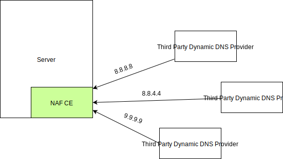
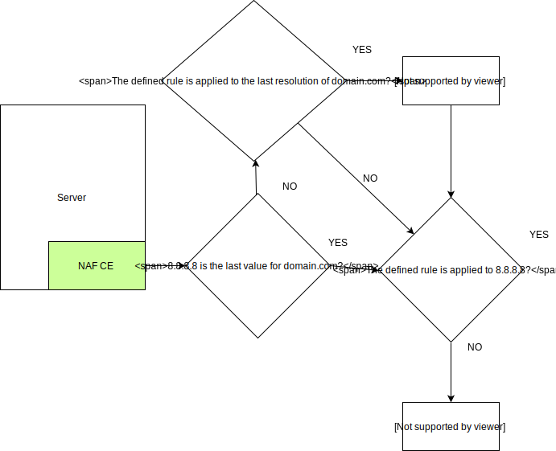

## Not Another Firewall

NAF-CE is a solution for adding or deleting iptables rules in order to allow or deny hosts based on DNS resolution.
NAF-CE is not a firewall and doesn't replace one. Its a custom solution for small teams of developers that wants to collaborate on a dedicated server without exposing it to everyone and without having to deal with complex configurations.

NAF-CE check the domain resolution for each domain and add or delete the defined "allow_rule" rule replacing the {ip} keyword with the resolution of the domain name

It should be use with a dynamic DNS provider such as DuckDNS. If you use DuckDNS please consider donating to their project.

## Why did I build this software?

We were a group of friends connecting to a remote server that we didn't want to expose to the whole internet.
We didn't want to deal with setting up a vpn as we only had one server at our provider and it seemed like overkill.
Portknocking was tedious at times, especially for persistent connections. Whitelisting our IPs was an option but since
these could change we needed this to be dynamic.

## How it works?

A list of domain names need be registered. Once they are registered
NAF-CE will ask and apply the `allow_rule` set by default to `-A INPUT -s {ip} ACCEPT` being `{ip}` the resolution
of each of the domains registered.

In the next image, NAF-CE will have 3 domains registered:

- domain1.com
- domain2.com
- domain3.com

Each five minutes NAF-CE will try to query the IP address of each domain.

DNS Servers will provide NAF-CE the requested information.

Finally NAF-CE will follow the next workflow diagram for each response maintaining or updating `iptables` rules.

## Requirements
- python3
- iptables

### Tested on
- Ubuntu 18.04
- Proxmox PVE 5
- Debian 10

## Installation
* git clone https://github.com/elchicodepython/naf-ce
* cd naf-ce
* sudo ./setup.sh
* sudo crontab -u root -e 
* Add the following line to crontab: `*/5 * * * * /usr/bin/naf-ce update`

### Interactive configuration

To access to the interactive configuration execute `/usr/bin/naf-ce edit`

## Manual Configuration

NAF-CE is based in a configuration file placed on /etc/naf/rules.json

Example of configuration file:

{
	"allow_rule": "-A INPUT -s {ip} ACCEPT",
	"domains": [
		{
		"name": "domain.com",
		"ip": "8.8.8.8"
		}
	]
}

### Add a domain

* Open /etc/naf/rules.json
* Add inside domains:[] a domain with the following structure: {"name": "mydomain.com", ip:""}
* It doesn't matter if we leave the IP empty at the moment
* Save the file

### Manual updating rules
* sudo naf-ce update

